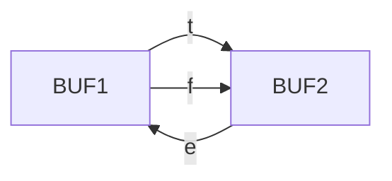
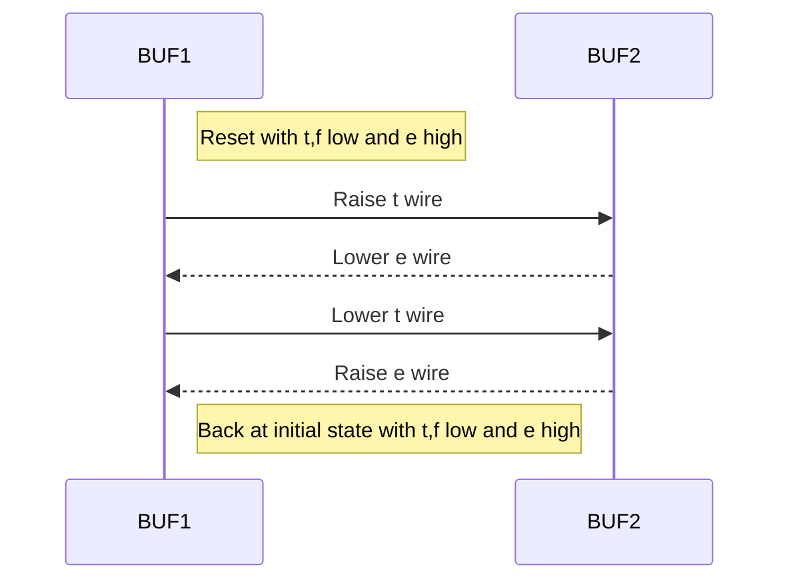
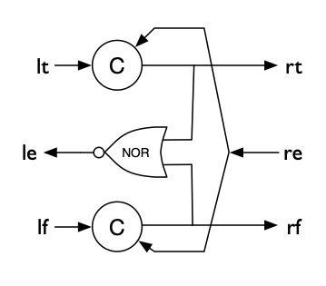
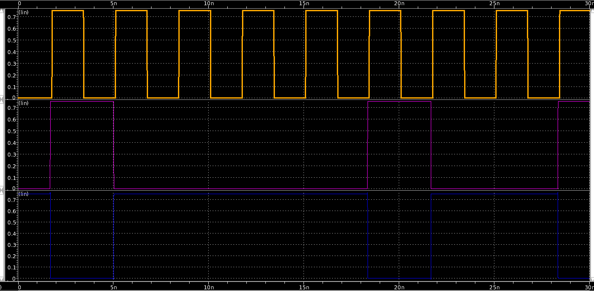

# QDI Buffer - A More complicated example

In this example we will generate an asynchronous circuit built using pipelined 
4-phase handshake circuits that are quasi-delay-insensitive (QDI).

In our example, two buffers communicating a 1-bit data value using a 4-phase handshake
will use a bundle of three wires consisting of:

- two data rails (a true and false rail) 
- an acknowledge (or enable) wire



We will use return-to-zero signaling on the data wires. So, for example,
to send a value of `1` from BUF1 to BUF2, we would do the following:


## Circuit implementation of a Buffer
We will use a simple implementation of a weak-conditioned-half-buffer(WCHB)
handshake circuit to implement BUF1, shown in the schematic below.  The circle
with a 'C' represents a [Muller Consensus or
C-element](https://en.wikipedia.org/wiki/C-element) which is a dynamic gate that
sets its output value to the input value when both inputs are the same.  



### Generating values
We'll first change the `Main` module from using a clock as the input
to the inverter, to a digital source that can provide a pre-determined
sequence of values.  This ['VerilogSrc'][circuitbrew.elements.VerilogSrc] is
shown below:

``` py linenums="1" title='inverter_sim_01.py'
--8<--- "circuitbrew/examples/inverter_sim/inverter_sim_01.py"
```

The source module can take a list of values that it loops through and repeats during
simulation.  In this example, we generate a vector of 10 1-bit values to source.

The waveform of this simulation is below.  The top waveform is the source clock, and then below 
is the input and output of the inverter.



### Checking the values
Checking the expected values can be done using a ['VerilogBucket'][circuitbrew.elementes.VerilogBucket].
We provide the expected values list to the bucket by inverting the randomly generated
list supplied to the `VerilogSrc`:

``` py linenums="1" title='inverter_sim_02.py'
--8<--- "circuitbrew/examples/inverter_sim/inverter_sim_02.py"
```

If you then look at the Verilog-A output file (`top.valog` if you're using hspice), you will
see the following output:

```
At time  1.78 ns verified 0th value 0 to test.dat
At time  5.11 ns verified 1th value 1 to test.dat
At time  8.44 ns verified 2th value 1 to test.dat
At time 11.78 ns verified 3th value 1 to test.dat
At time 15.11 ns verified 4th value 1 to test.dat
At time 18.44 ns verified 5th value 0 to test.dat
At time 21.78 ns verified 6th value 1 to test.dat
At time 25.11 ns verified 7th value 1 to test.dat
At time 28.44 ns verified 8th value 0 to test.dat
```


## Using model simulation to generate expected vectors
While providing the expected values for a simple test case like this is trivial, the
real power of CircuitBrew lies in the ability to generate expected vectors from complex
circuits that instance multiple blocks.

To do this, CircuitBrew has a simple yet powerful discrete-event-simulation framework built in to it.
If you provide a method to implement a simulation model for each Module, then it
will execute the complete system model for your circuit instanced in `Main` and
generate the output values for each port.  Assuming your model is correct, then
you can seamlessly use these output values as the expected values provided to
the HSPICE simulation.

For this particular example, we only need to provide a simulation model for the inverter, via an
async `sim` method.

``` py linenums="1" title='inverter_sim_03.py' hl_lines='19-22 45'
--8<--- "circuitbrew/examples/inverter_sim/inverter_sim_03.py"
```

While we'll delve into more detail on how model simulation works in a different
section, in general, every port has a `recv` and `send` method.  In your `sim` method for
each block all you need to do is:

- call `await self.INPUTPORT.recv()` to receive all the inputs to your port
- compute the outputs based on the inputs
- call `await self.OUTPUTPORT.send(output_val)` on all the output ports to send the computed values
- repeat 

We have to use the Python `async` keywords because the simulation methods relies on 
concurrent event-based simulation libraries for execution of the sim code.  Under the hood,
CircuitBrew currently uses the [Curio async library](https://curio.readthedocs.io/en/latest/), 
although this may change in future iterations.

For every Module that doesn't provide a `sim` method, CircuitBrew will execute the default
behavior which is to forward all values received on an InputPort to its fanout connections
transparently.

If you execute this example, it will run the same way in HSPICE as the last example, except
you don't generate and provide expected vectors in the `Main` method.

In the next example, we will take a look at a more complicated example.
