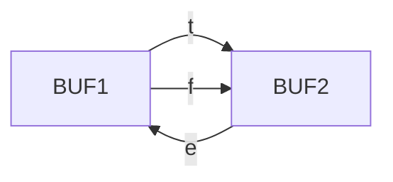
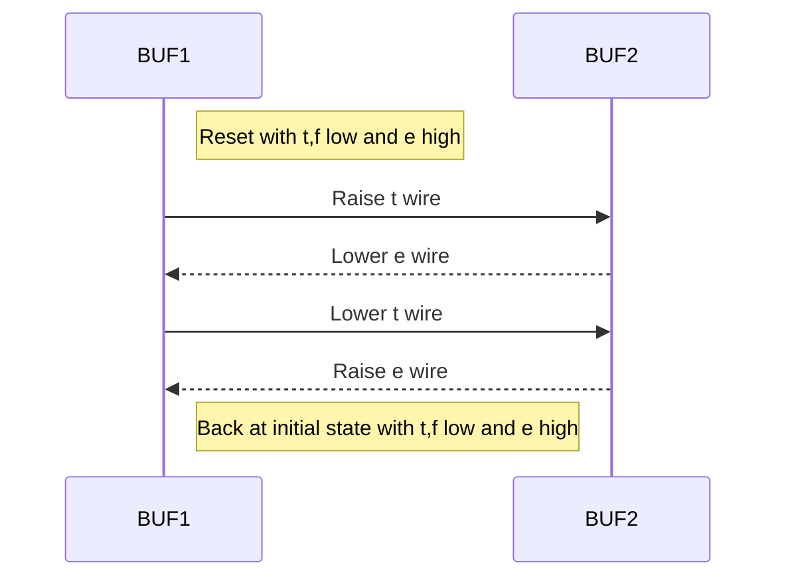

# QDI Buffer - A More complicated example

## Introduction
In this example we will generate an asynchronous circuit built using pipelined 
4-phase handshake circuits that are quasi-delay-insensitive (QDI).

### Communication protocol
In our example, two buffers communicating a 1-bit data value using a 4-phase handshake
will use a bundle of three wires consisting of:

- two data rails (a true and false rail) 
- an acknowledge (or enable) wire



We will use return-to-zero signaling on the data wires. So, for example,
to send a value of `1` from BUF1 to BUF2, we would do the following:


### Circuit implementation of a Buffer
We will use a simple implementation of a weak-conditioned-half-buffer(WCHB)
handshake circuit to implement BUF1, shown in the schematic below.  The circle
with a 'C' represents a [Muller Consensus or
C-element](https://en.wikipedia.org/wiki/C-element) which is a dynamic gate that
sets its output value to the input value when both inputs are the same.  


## Building blocks
First, let's take a look at how we build the individual gates in the WCHB 
schematic.

### Parametrized Inverter
Although we saw a simple [inverter](inverter.md) previously, this
time we're going to show you how to build a parametrized inverter based on its
sizes and vt choices.  This is built in to the standard [gates][circuitbrew.gates]
library, but let's take a look at the implementation:

``` py linenums="1" title='wchb_inverter.py'
--8<--- "circuitbrew/examples/wchb/wchb_inverter_01.py"
```

Adding parameters to a Module is done in the following way:

- Add each parameter as a type annotation ([Param][circuitbrew.module.Param])
- Use the parameters as a regular Python attribute in your `build` method

When you want to use the parametrized Module, you call `Parametrize` on the 
Module you want with the parameter values, which will return a new Module (class)
that you can then instance.  If you don't want to keep around the parametrized
class for more instances, you could also simply do:

``` py
    self.inv = Parameterize(Inv, p_strength=3, n_strength=3, vt='svt')()

```

### Parametrized NOR
Now let's take a look at a different use for parameters: Specifying the width of
a port. 

We've already seen how to do a [2-input NOR](nor2.md), but
what if we want to build a generic N-input NOR?  Well, we need to first declare
N as a Param.  But how do we pass this into the InputPorts as the width, since it
hasn't been defined yet?  The way we do this is by using [Param][circuitbrew.module.Param]
as a placeholder function with the name of the parameter:

``` py linenums="1" title='wchb_nor2_01.py'
--8<--- "circuitbrew/examples/wchb/wchb_nor2_01.py"
```

Once [Parameterize][circuitbrew.module.Parameterize] is called with the actual value for `N`,
it will resolve itself when `a` is accessed for the first time.  The rest of the implementation
of NorN just needs to use `self.N` in an appropriate way to build the circuit like so:


``` py linenums="1" title='wchb_nor2_02.py'
--8<--- "circuitbrew/examples/wchb/wchb_nor2_02.py"
```

Here, you can see how we used the `|` and `&` operators in a loop to construct the
CMOS stacks.

The resulting SPICE looks like 

```spice
.subckt Main 
xNorN_N_3_size_2_inst_0 a_0 a_1 a_2 b_3 p_4 p_5 NorN_N_3_size_2
.ends


.subckt NorN_N_3_size_2 a[0] a[1] a[2] b p.gnd p.vdd
xmn0 b a[1] p.gnd p.gnd sky130_fd_pr__nfet_01v8_lvt w=2 l=0.5
xmn1 b a[0] p.gnd p.gnd sky130_fd_pr__nfet_01v8_lvt w=2 l=0.5
xmn2 b a[2] p.gnd p.gnd sky130_fd_pr__nfet_01v8_lvt w=2 l=0.5
xmp0 d_0 a[0] b p.vdd sky130_fd_pr__pfet_01v8_lvt w=2 l=0.5
xmp1 d_1 a[1] d_0 p.vdd sky130_fd_pr__pfet_01v8_lvt w=2 l=0.5
xmp2 p.vdd a[2] d_1 p.vdd sky130_fd_pr__pfet_01v8_lvt w=2 l=0.5
.ends
```

Notice that the parameterized Nor sub-circuit has its parameter values
inserted into the name.  If another Nor is parameterized (say with N=4),
then it will have a different sub-circuit definition with `N_4` in the name.

### C-element
The c-element will be a state-holding gate, with the pull-up and pull-down
both just having the two terms in series.  We will use combinational
feedback to maintain the output when the inputs disagree in value.


``` py linenums="1" title='wchb_c2_01.py' 
--8<--- "circuitbrew/examples/wchb/wchb_c2_01.py"
```